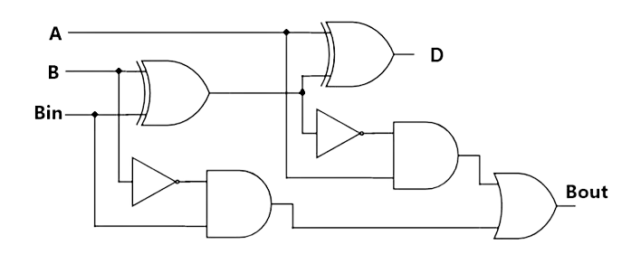

### INTRODUCTION

A full subtractor is a combinational circuit that performs subtraction involving three bits, namely A (minuend), B (subtrahend), and Bin (borrow-in) as seen in Figure 1 below. It accepts three inputs: A (minuend), B (subtrahend) and a Bin (borrow bit) and it produces two outputs: D (difference) and Bout (borrow out). The logical expression for the same circuit is given as-

D = A ⊕ B ⊕ Bin
 Bout = A'B + A'Bin + BBin

 

      
  
<i>Full-Subractor logical circuit</i>

 

<table class="tg" style="table-layout: fixed; width: 367px">
            <colgroup>
            <col style="width: 53px">
            <col style="width: 53px">
            <col style="width: 52px">
            <col style="width: 105px">
            <col style="width: 104px">
            </colgroup>
            <thead>
              <tr>
                <th class="tg-c3ow" colspan="3">Inputs</th>
                <th class="tg-c3ow" colspan="2">Outputs</th>
              </tr>
            </thead>
            <tbody>
              <tr>
                <td class="tg-wp8o">A</td>
                <td class="tg-wp8o">B</td>
                <td class="tg-wp8o">Bin</td>
                <td class="tg-wp8o">Bout(Borrow)</td>
                <td class="tg-wp8o">D(Difference)</td>
              </tr>
              <tr>
                <td class="tg-wp8o">0</td>
                <td class="tg-wp8o">0</td>
                <td class="tg-wp8o">0</td>
                <td class="tg-wp8o">0</td>
                <td class="tg-wp8o">0</td>
              </tr>
              <tr>
                <td class="tg-wp8o">0</td>
                <td class="tg-wp8o">0</td>
                <td class="tg-wp8o">1</td>
                <td class="tg-wp8o">1</td>
                <td class="tg-wp8o">1</td>
              </tr>
              <tr>
                <td class="tg-wp8o">0</td>
                <td class="tg-wp8o">1</td>
                <td class="tg-wp8o">0</td>
                <td class="tg-wp8o">1</td>
                <td class="tg-wp8o">1</td>
              </tr>
              <tr>
                <td class="tg-wp8o">0</td>
                <td class="tg-wp8o">1</td>
                <td class="tg-wp8o">1</td>
                <td class="tg-wp8o">1</td>
                <td class="tg-wp8o">0</td>
              </tr>
              <tr>
                <td class="tg-wp8o">1</td>
                <td class="tg-wp8o">0</td>
                <td class="tg-wp8o">0</td>
                <td class="tg-wp8o">0</td>
                <td class="tg-wp8o">1</td>
              </tr>
              <tr>
                <td class="tg-wp8o">1</td>
                <td class="tg-wp8o">0</td>
                <td class="tg-wp8o">1</td>
                <td class="tg-wp8o">0</td>
                <td class="tg-wp8o">0</td>
              </tr>
              <tr>
                <td class="tg-wp8o">1</td>
                <td class="tg-wp8o">1</td>
                <td class="tg-wp8o">0</td>
                <td class="tg-wp8o">0</td>
                <td class="tg-wp8o">0</td>
              </tr>
              <tr>
                <td class="tg-baqh">1</td>
                <td class="tg-baqh">1</td>
                <td class="tg-baqh">1</td>
                <td class="tg-baqh">1</td>
                <td class="tg-baqh">1</td>
              </tr>
            </tbody>
            </table>

 

Stuck-at Fault is a Functional Fault on a Boolean (Logic) Function Implementation. It is not a Physical Defect Model, It is an abstract fault model.  A logic stuck-at 0 means when a logic 1 is applied to the line, it produces a logical error, which means 1 becomes 0. Simultaneously if it is stuck-at 1, when a logic 0 is applied, it produces a logical error and becomes 1.

Stuck at faults occur when a line is permanently stuck to Vdd or ground giving a faulty output. This line may be an input or output to any gate. Also this fault can be single or multiple stuck at faults.

It is also called a permanent fault model because the faulty effect is assumed to be permanent, in contrast to intermittent faults which occur (seemingly) at random and transientfaults which occur sporadically, perhaps depending on operating conditions like temperature, power supply voltage or on the data values (high or low voltage states) on surrounding signal lines. The single stuck-at fault model is structural because it is defined based on a structural gate-level circuit model.

Sa0 faults are specifically caused when the line in question is connected to the ground. As a result of this, no matter the input to the line, it will only carry and output the 0 signal.

 

A full subtractor circuit is designed using NOT, AND and XOR gates. Stuck at zero faults in various locations in the input and output wires can be observed. For different values of inputs, the values of outputs obtained for specific stuck-at 0 faults can be different from the expected, ideal output, using which we can identify the presence of the fault.

 

      
  
<i>Types of logic gates</i>

